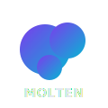

<p align="center">
  
</p>

<h1 align="center">Molten</h1>

<p align="center">
  <strong>The liquid terminal for AI coding agents</strong><br/>
  Dock, split, merge, and reshape everything.
</p>

<p align="center">
  <a href="https://github.com/glowElephant/Molten/releases"></a>
  <a href="https://github.com/glowElephant/Molten/blob/main/LICENSE"></a>
  <a href="https://github.com/glowElephant/Molten/stargazers"></a>
  
</p>

---

## What is Molten?

Molten is a **desktop terminal wrapper** built for managing multiple AI coding agent sessions — Claude Code, Codex, Gemini CLI, Aider, and more.

Run multiple agents side by side, drag panes into any layout, and let Claude Code's TeamCreate spawn agents into separate Molten sessions via the built-in tmux shim.

### Why Molten?

| Problem | Molten's Answer |
|---|---|
| Multi-agent tools are macOS/tmux-only | **Cross-platform** — Windows, macOS, Linux |
| No visibility into parallel agents | **Split panes** with status detection |
| No inter-session communication | **Pipe & broadcast** — agents can share output |
| Fixed, boring layouts | **Unity-style docking** — drag panes anywhere |
| tmux required for TeamCreate on Windows | **Built-in tmux shim** — zero setup |

---

## Features

### Multi-Session Terminal
- **xterm.js** with WebGL rendering for smooth performance
- **Auto status detection** — thinking, waiting, idle, error
- **Session persistence** — layout, scrollback, and settings survive restarts

### Unity-Style Docking
Drag session headers to rearrange panes. Drop zones show where the pane will land.

- **Top/Bottom** — vertical split
- **Left/Right** — horizontal split
- **Center** — swap positions
- **Drag-to-resize** dividers between panes

### tmux Shim (Claude Code TeamCreate)
A built-in fake tmux that intercepts Claude Code's tmux commands and translates them to Molten API calls. Claude Code's TeamCreate spawns agents into separate Molten sessions automatically.

### 12 Color Themes
Obsidian, Dracula, Nord, Monokai, Cyberpunk, Catppuccin, Solarized, Midnight, Matrix, Sunset, Arctic, Ember — each with unique background textures.

### Inter-Session Communication
- **Pipe** — send one session's last output to another
- **Broadcast** — send text to all sessions at once

### Trigger System
Regex pattern matching on terminal output with configurable actions:
- Desktop notifications
- Auto-run commands
- Sound alerts

### IME Input Bar (Ctrl+I)
Dedicated input bar for reliable Korean/CJK text input, bypassing xterm.js IME issues.

### Quick Commands
Saved command presets with one-click execution. Useful for frequently-used launch commands.

---

## Prerequisites

| Tool | Version | Install |
|------|---------|---------|
| **Rust** | latest stable | [rustup.rs](https://rustup.rs/) |
| **Node.js** | 18+ | [nodejs.org](https://nodejs.org/) |
| **pnpm** | 8+ | `npm install -g pnpm` |
| **Git Bash** | (Windows only) | Included with [Git for Windows](https://gitforwindows.org/) |

> **Windows note**: Molten uses Git Bash as the default shell. Make sure Git for Windows is installed.

---

## Quick Start

```bash
git clone https://github.com/glowElephant/Molten.git
cd Molten
pnpm install
pnpm tauri dev
```

First run compiles the Rust backend (~1-2 min). Subsequent runs are fast.

## Build for Production

```bash
pnpm tauri build
```

Output: `src-tauri/target/release/molten.exe` (+ installer in `src-tauri/target/release/bundle/`)

---

## tmux Shim Setup

The tmux shim is **optional** — only needed for Claude Code's TeamCreate feature.

```bash
# Copy the shim to a directory in your PATH
cp src-tauri/tmux-shim/tmux ~/bin/tmux
chmod +x ~/bin/tmux

# Verify
tmux -V
# Should output: tmux 3.4
```

The shim activates automatically inside Molten sessions (via `TMUX` env var). Usage:

```bash
# Inside a Molten session, just run Claude Code normally
claude --dangerously-skip-permissions

# When Claude uses TeamCreate, agents spawn into separate Molten sessions
```

---

## AI-Driven Self-Development

Molten is designed to be **developed by AI agents running inside Molten itself**. The infrastructure supports a capture→analyze→fix loop:

1. **Self-capture** — `captureSelf()` takes a screenshot of the Molten window (saved to `%TEMP%/molten-capture.png`), auto-triggered every 10s and after every UI action
2. **Programmatic control** — `window.__moltenExec(action)` exposes all UI actions as callable functions (session create/close/split/switch/type)
3. **API server** — all features controllable via HTTP (`http://127.0.0.1:9900`)
4. **Claude Code inside Molten** — an agent running in a Molten session can read the screenshot, identify visual bugs, edit source code, and restart the app

This means Claude Code can:
- Take a screenshot of Molten's current state
- Analyze rendering issues, broken layouts, or garbled text
- Fix the code directly
- Restart the app (`taskkill` + `pnpm tauri dev`)
- Verify the fix via another screenshot

Molten was largely built this way — Claude Code running inside Molten, fixing Molten.

---

## Keyboard Shortcuts

| Shortcut | Action |
|----------|--------|
| `Ctrl+N` | New session |
| `Ctrl+D` | Split (horizontal) |
| `Ctrl+Shift+D` | Split (vertical) |
| `Ctrl+W` | Close session |
| `Ctrl+Tab` | Next session |
| `Ctrl+1~9` | Switch to session N |
| `Ctrl+B` | Toggle sidebar |
| `Ctrl+P` | Command palette |
| `Ctrl+I` | Toggle IME input bar |
| `Ctrl+,` | Settings |
| `Ctrl+Shift+N` | Toggle notifications |

---

## Project Structure

```
Molten/
├── src/                        # React frontend
│   ├── components/
│   │   ├── Terminal/           # xterm.js terminal panel + IME bar
│   │   ├── SplitView/          # Split panes + Unity-style docking
│   │   ├── Sidebar/            # Session list + groups + drag reorder
│   │   ├── Settings/           # Settings modal (themes, triggers)
│   │   ├── QuickCommand/       # Quick command bar
│   │   ├── Notification/       # Notification panel
│   │   └── StatusBar/          # Keybinding hints
│   ├── stores/                 # Zustand state stores
│   │   ├── sessionStore.ts     # Session CRUD + ordering
│   │   ├── layoutStore.ts      # Split layout tree + docking
│   │   ├── settingsStore.ts    # App settings
│   │   ├── triggerStore.ts     # Regex triggers
│   │   └── messageBusStore.ts  # Inter-session communication
│   ├── utils/
│   │   ├── terminalManager.ts  # Global xterm.js instance manager
│   │   ├── triggerEngine.ts    # Trigger matching engine
│   │   └── workspacePersistence.ts  # Save/restore workspace
│   └── themes.css              # 12 color themes
├── src-tauri/                  # Rust backend
│   ├── src/
│   │   ├── pty.rs              # PTY management (portable-pty)
│   │   ├── api_server.rs       # Local HTTP API (port 9900)
│   │   ├── commands.rs         # Tauri commands
│   │   └── lib.rs              # App entry
│   └── tmux-shim/tmux          # Fake tmux script for Claude Code
└── package.json
```

## API Server

Molten runs a local API server on `http://127.0.0.1:9900` for the tmux shim and external integrations:

| Endpoint | Description |
|----------|-------------|
| `GET /` | Health check |
| `GET /api/sessions` | List PTY session IDs |
| `GET /api/session/create` | Create new session |
| `GET /api/session/close` | Close active session |
| `GET /api/session/count` | Session count |
| `GET /api/session/switch/:n` | Switch to session (1-based) |
| `GET /api/pty/write/:id/:text` | Write text to specific PTY session |
| `GET /api/split/horizontal` | Split active pane horizontally |
| `GET /api/split/vertical` | Split active pane vertically |

---

## Tech Stack

| Layer | Technology |
|---|---|
| App Shell | [Tauri 2](https://tauri.app/) |
| Backend | Rust (portable-pty, serde, tokio) |
| Frontend | React 19 + TypeScript |
| Terminal | [xterm.js](https://xtermjs.org/) + WebGL |
| State | [Zustand](https://github.com/pmndrs/zustand) |
| Animations | [Framer Motion](https://www.framer.com/motion/) |

---

## Contributing

Contributions welcome! Fork, branch, commit, PR.

---

## License

[MIT](LICENSE)

---

<p align="center">
  Built with Rust, React, and a lot of melting.
</p>
